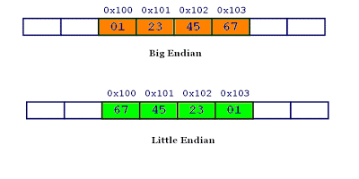

### 1.字节序
字节序，又称端序或尾序，指的是多字节数据在内存中的存放顺序。例如一个int型变量x占用4个字节，假设它的起始地址&x为0x10，那么x将会被存储在
0x10、0x11、0x12和0x13位置上。

在用C++写的客户端和Java写的服务端的通信时，发现数据通过TCP连接传输后收到的与发送的不一致，所以要引入大端和小端的概念。

### 2.大端和小端
计算机有两种储存数据的方式：大端字节序（Big Endian）和小端字节序（Little Endian）。

以一个两字节short型变量0x0102的存储举例：
+ 大端字节序：高位字节在前，低位字节在后，01|02，符合人们的读写习惯。
+ 小端字节序：低位字节在前，高位字节在后，02|01。

  
一个四字节数据0x01234567分别用大小端字节序存储的结果如上图所示。

### 3.WHY？
计算机处理字节序的时候，不知道什么是高位字节，什么是低位字节。它只知道按顺序读取字节，先读第一个字节，再读第二个字节......
如果是大端字节序，先读到的就是高位字节，后读到的就是低位字节；小端字节序正好相反。

如果这样，那统一用符合我们人类读写习惯的大端序就好了呀，为何还要弄出个小端序了？

这是疑问计算机电路先处理低位字节，效率比较高，因为计算都是从低位开始的，所以计算机的内部处理都是小端字节序。
但是人类还是习惯读写大端字节序，所以，除了计算机的内部处理，其他的场合几乎都是大端字节序，比如网络传输和文件储存。

### 4.网络序和主机序
网络字节序：TCP/IP各层协议将字节序定义为Big Endian，因此TCP/IP协议中使用的字节序是大端序。

主机字节序：整数在内存中存储的顺序，目前以Little Endian比较普遍（不同的CPU有不同的字节序）。

回到开头说的问题，当一个C++的程序要与一个Java程序交互时，发现收发的数据不一致，这是因为：
+ C++语言编写的程序里数据存储顺序是跟编译平台所在的CPU相关的，而现在比较普遍的x86处理器是Little Endian。
+ Java编写的程序则唯一采用Big Endian方式来存储数据。

所以，如果你的C++程序通过socket将变量a = 0x12345678的首地址传递给了Java程序，由于Java采取Big Endian方式存取数据，
很自然的它会将你的数据解析为0x78563412，这样问题就出现了。

### 5.转换
为避免开头说到的网络通信中存在的问题，我们可以在传输数据之前和接收数据之后对数据进行相应处理，也就是主机序和网络序的转换。

C++提供了相应的函数接口，htonl、htons用于主机序转换到网络序，ntohl、ntohs用于网络序转换到主机序。
其中h表示host主机，n表示network网络。