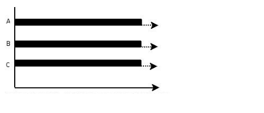
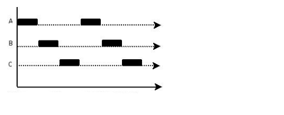

### 并行和并发

并行（parallel）和并发（concurrency）都可以表示多个任务一起执行，并行是物理上的同时发生（simultaneous），并发是逻辑上的同时发生。如上图，两队人等着用一台咖啡机就是并发，两队人分别用两台咖啡机就行并行。

### 并行

并行指的是同一时刻多条指令在多个处理器上同时执行，重点在**同时**，不管是多进程还是多线程任务，只要是在多处理器上同时执行就是并行。

### 并发

并发指的是同一时刻有很多任务，但这些任务只能交替执行，重点在**交替**，可以想象在一根流水线上有多种货物交替被运输出来。