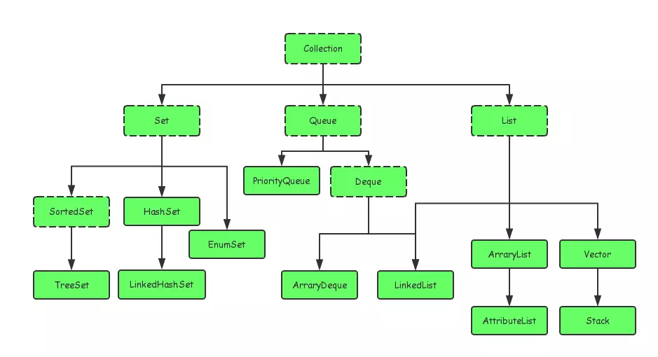

### 1、概念
在Java当中，如果有一个类专门用来存放其它类的对象，这个类就叫做容器，也叫做集合，集合就是将若干性质相同或相近的类对象组合在一起而形成的一个整体。
相较于数组，集合的容量是可以自动调节的。

### 2、Collection

Collection 接口是 Set、Queue 和 List 的父接口：

> * Set 代表无序、无重复的集合
> * Queue 代表队列
> * List 代表有序、可重复的集合

Collection 接口中定义的方法主要有：添加元素 add、删除元素 remove、保留元素 retainAll、清空元素 clear、集合大小 size、判空 isEmpty 和转换数组 toArray，还有个 iterator() 方法。

#### Iterator

这个接口主要定义了三个方法：hasNext()、next() 和 remove()，主要被用来遍历集合中的元素。

#### Set

#### Queue

#### List

### 3、Map

