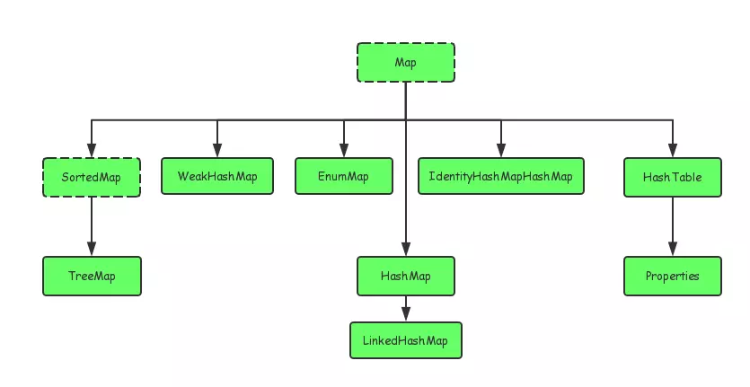

### 1、概念

在Java当中，如果有一个类专门用来存放其它类的对象，这个类就叫做容器，也叫做集合，集合就是将若干性质相同或相近的类对象组合在一起而形成的一个整体。
相较于数组，集合的容量是可以自动调节的。


### 2、Collection


Collection 接口是 Set、Queue 和 List 的父接口：

> * Set 代表无序、无重复的集合
> * Queue 代表队列
> * List 代表有序、可重复的集合

Collection 接口中定义的方法主要有：添加元素 add、删除元素 remove、保留元素 retainAll、清空元素 clear、集合大小 size、判空 isEmpty 和转换数组 toArray，还有个 iterator() 方法。

#### Iterator

这个接口主要定义了三个方法：hasNext()、next() 和 remove()，主要被用来遍历集合中的元素。

```java
public class Test {
    public static void main(String[] args) {
        List<String> list = new ArrayList<>();
        Collections.addAll(list, "123", "456", "789");
        Iterator<String> iterator = list.iterator();
        while (iterator.hasNext()) {
            String string = iterator.next();
            if (string.equals("456")) {
                string = "aaa";  // 1 这个修改无用，The value "aaa" assigned to 'string' is never used
                list.add("aaa");  // 2 Exception in thread "main" java.util.ConcurrentModificationException
                iterator.remove();  // 3 list:[123, 789]
            }
        }
    }
}
```

> * 1.使用 Iterator 对集合原始进行迭代时，集合元素的值传给了迭代变量，所以修改迭代变量的值对集合变量无影响
> * 2.如果你在迭代的时候修改集合，那么就会因为迭代器与集合不同步而抛出这个异常
> * 3.Iterator 自带的 remove 方法

#### Set


#### Queue

#### List


### 3、Map




### 4、Relation

