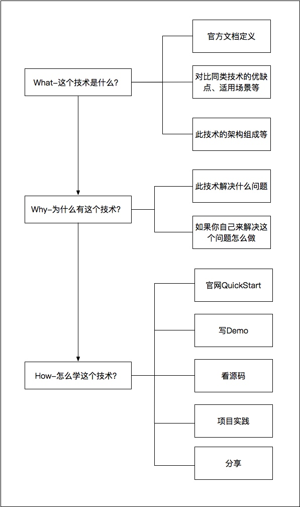

### Reference

[如何学习后端技术](https://github.com/superhj1987/pragmatic-java-engineer/blob/master/book/chapter1-servertech/how-to-study.md)

### Content

#### 1、扎实的计算机基础知识(408四门课)

> * 数据结构和算法：程序由数据和算法组成，数组、链表、堆、栈、树、森林、图、查找、排序、哈希
> * 计算机操作系统：资源调度、任务调度、IO调度、进程通信
> * 计算机组成原理：CPU、内存、硬盘、冯诺依曼
> * 计算机网络：OSI/TCPIP模型、TCP/IP、三次握手、四次挥手

#### 2、知其然更要知其所以然

> * 拒绝重复劳动，会用——深入原理——懂得优化
> * 看到好的代码实现、架构设计时要学习别人的思路，尝试思考：这个问题我会怎样解决；与这里比较优劣如何；这类问题的基本解决思路是啥
> * 对新人来说，技术先要有深度，只有在某一领域有了深入的理解和研究，才能融会贯通，迅速扩大自己的知识面。一个什么都做过、什么都用过却什么也不精通的人可替代性太强了

#### 3、动手实践、刻意练习

> * 程序员按照时间、学习和培训的方式进行重要性排序是合理的，学习技术的最佳实践——项目驱动型学习，也就是动手实践
> * 动手实践能让你快速入门，但只有刻意练习才能让你熟练使用。当然这里的可以练习并非指重复劳动，而是带着思考去练习，多想下为什么这么做？我能找到更好的做法么？

#### 4、持续学习

> * 活到老学到老，互联网技术日新月异，更迭速度太快了，所以要对新事物、新技术具有敏感性，不断涉猎业界的最新知识点，扩充自己的知识库
> * 逃离舒适区，敢于学习和使用新技术，这样才能让自己具有持续的学习兴趣，促进自己持续进步

#### 5、计算机思维

> * 计算机思维的本质就是冯诺依曼体系所描述的：数据存储、顺序执行
> * 在遇到问题时，可以下意识的用诸如二进制存储、防御编程、循环遍历、位运算、多进程/线程以及常用的数据结构和算法来思考，将人类语言需求转化为计算机语言

#### 6、自我总结

> * 解决问题之后要及时总结，找出问题发生的本质原因，思考下如何避免同样的问题，从中有什么启发和收获，举一反三，融会贯通
> * 自我总结的方式包括记笔记、写博客、做分享，更好的方式是与别人交流，一来可以通过互相学习来提升，二来分享知识的成就感会让你更加乐于总结和分享

#### 7、职业规划

> * 长期规划，如几年之内在某个技术领域做到专家的级别，得到项目组、部门甚至公司同事和领导的认可
> * 短期规划，比如学习一门技术，熟读一份源码，阅读基本技术书籍，减肥锻炼身体，提升沟通交流技巧，加强自身的管理技能...

#### 8、学习新技术

#### 9、总结

> * 初/终极程序员：这一层级的程序员包括入门没有多久的新手以及相关技能不熟练的程序员。已经掌握了基本的程序编写技能，但无法保证代码质量，需要在高级以上程序员的指导才能达到工作目标。从职业发展来看，这一层级应该是一个过渡层级，长期处于此层的程序员处在非常不利的状态
> * 高级程序员：渡过了第一层级之后，除了掌握了基本的编码技能，还熟练掌握了设计模式、常用类库等工作常用技能，并能够熟练的将需求实现成程序，保质保量的完成交付。此层级的程序员才真正成为工程师，是工作的中坚力量，除了能够很好地完成自己的工作外，也能够指导初/中级程序员完成工作
> * 项目经理/技术经理、架构师：高级程序员再往前发展，会有两个方向。走管理会成为项目经理或者技术经理，前者主要负责项目进度把控、协调沟通等，后者则除了项目管理之外兼具团队管理的职责；走技术路线，会发展为资深程序员、架构师，能够把控一个系统的整体架构或者精通某一领域技术，做好技术选型和系统设计工作
> * 部门经理/技术总监、技术专家：这一层级的部门经理和技术总监已经基本脱离了程序员的含义，都不再是单纯的技术工作，管理占了日常工作的大部分。相比起之前，更需要的是对团队整体的把控，包括做事、带人、看方向等。而深钻某一领域技术的程序员在这一层级会成为技术专家，为技术团队提供领域技术的指导咨询工作
> * CTO: 这一层级是程序员最顶级的职位。其需要的能力包括资源整合规划能力、技术战略规划能力、领导艺术、企业文化和制度建设能力。其中资源整合包括技术资源整合、知识整合、自我行销、人际关系整合