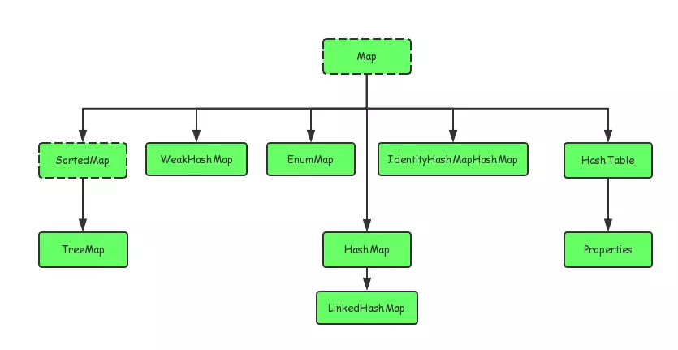
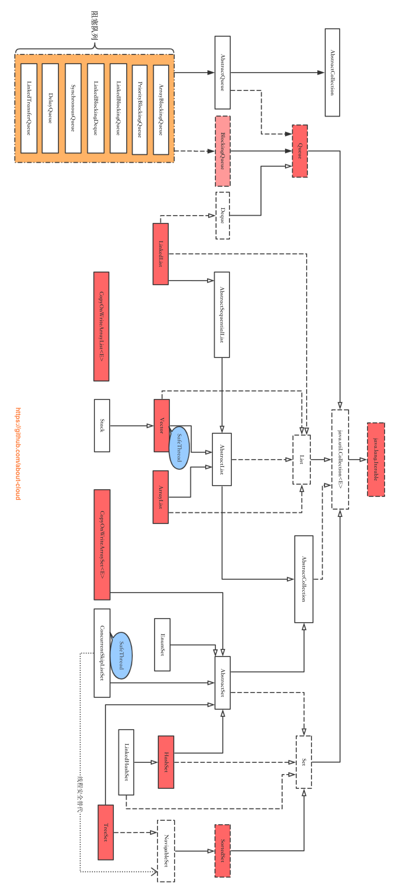

### 1、概念

在Java当中，如果有一个类专门用来存放其它类的对象，这个类就叫做容器，也叫做集合，集合就是将若干性质相同或相近的类对象组合在一起而形成的一个整体。
相较于数组，集合的容量是可以自动调节的。


### 2、Collection


Collection 接口是 Set、Queue 和 List 的父接口：

> * Set 代表无序、无重复的集合
> * Queue 代表队列
> * List 代表有序、可重复的集合

Collection 接口中定义的方法主要有：添加元素 add、删除元素 remove、保留元素 retainAll、清空元素 clear、集合大小 size、判空 isEmpty 和转换数组 toArray，还有个 iterator() 方法。

#### Iterator

这个接口主要定义了三个方法：hasNext()、next() 和 remove()，主要被用来遍历集合中的元素。

```java
public class Test {
    public static void main(String[] args) {
        List<String> list = new ArrayList<>();
        Collections.addAll(list, "123", "456", "789");
        Iterator<String> iterator = list.iterator();
        while (iterator.hasNext()) {
            String string = iterator.next();
            if (string.equals("456")) {
                string = "aaa";  // 1 这个修改无用，The value "aaa" assigned to 'string' is never used
                list.add("aaa");  // 2 Exception in thread "main" java.util.ConcurrentModificationException
                iterator.remove();  // 3 list:[123, 789]
            }
        }
    }
}
```

> * 1.使用 Iterator 对集合原始进行迭代时，集合元素的值传给了迭代变量，所以修改迭代变量的值对集合变量无影响
> * 2.如果你在迭代的时候修改集合，那么就会因为迭代器与集合不同步而抛出这个异常
> * 3.Iterator 自带的 remove 方法

#### Set

Set 接口中定义的方法与 Collection 中基本一致，没有提供任何额外方法。不同之处只在于 Set 不允许包含相同的元素，若试图将两个相同的元素 add 进同一个 Set 中，那么会添加失败。 

#### Queue

Queue 被用来模拟队列这种数据结构，具有“先进先出”的特性。

```java
public class Test {
    public static void main(String[] args) {
        Queue<Integer> queue = new LinkedList<>();
        Collections.addAll(queue, 1, 2, 3);  // [1, 2, 3]
        queue.add(4);  // [1, 2, 3, 4]
        queue.offer(5);  // [1, 2, 3, 4, 5]
        queue.remove();  // [2, 3, 4, 5]
        queue.poll();  // [3, 4, 5]
        System.out.println(queue.element());  // 3 [3, 4, 5]
        System.out.println(queue.peek());  // 3 [3, 4, 5]
    }
}
```

#### List

List 代表一个元素有序、可重复的集合，集合中的每个元素都有其顺序索引。它允许使用重复元素，可以通过索引来访问指定位置的元素。

相比于父接口，它在接口定义中多了以下的这些方法：

```java
public class Test {
    public static void main(String[] args) {
        List<String> list = new ArrayList<>();
        Collections.addAll(list, "1", "2", "3");
        List<String> addAll = Arrays.asList("4", "5");
        list.addAll(1, addAll);  // [1, 4, 5, 2, 3]
        list.replaceAll(a -> a + 1);  // [11, 41, 51, 21, 31]
        list.sort(String::compareTo);  // [11, 21, 31, 41, 51]
        System.out.println(list.get(2));  // 31
        list.set(3, "11");  // [11, 21, 31, 11, 51]
        list.add(1, "66");  // [11, 66, 21, 31, 11, 51]
        list.remove(5);  // [11, 66, 21, 31, 11]
        System.out.println(list.indexOf("11"));  // 0
        System.out.println(list.lastIndexOf("11"));  // 4
    }
}
```


### 3、Map



Map 用来保存具有映射关系的数据（key-value），key 不允许重复，必须是不可变类型，不允许有 equals 的两个对象。以下举例均基于 `JDK1.8`。

#### Map 中的方法

```java
public interface Map<K, V> {
    // 查询操作
    int size();  // 键值对个数，超过int最大值按最大值算
    int isEmpty();  // map是否不包含键值对
    boolean containsKey(Object key);  // 是否包含key
	boolean containsValue(Object value);  // 是否包含value
    V get(Object key);  // 获得key对应的value
    
    // 修改操作
    V put(K key, V value);  // 添加键值对，返回之前的value，若没有就返回null
	V remove(Object key);  // 移除键值对，返回之前的value，若没有就返回null
    
    // 批量操作
    void putAll(Map<? extends K, ? extends V> m);  // 批量添加键值对
    void clear();  // 清空map
    
    // 视图
    Set<K> keySet();  // key的set集合
    Collection<V> values();  // value的集合
    Set<Map.Entry<K, V>> entrySet();  // Map.Entry的set集合
    interface Entry<K,V> {}
    
    // 比较和哈希
    boolean equals(Object o);  // 两map的entrySet相同时equal
    int hashCode();  // map的哈希值
    
    // 默认方法
    default V getOrDefault(Object key, V defaultValue)； 
    default void forEach(BiConsumer<? super K, ? super V> action)；
    default void replaceAll(BiFunction<? super K, ? super V, ? extends V> function)；
    default V putIfAbsent(K key, V value)；
    default boolean remove(Object key, Object value)；
    default boolean replace(K key, V oldValue, V newValue)；
    default V replace(K key, V value)；
    default V computeIfAbsent(K key, Function<? super K, ? extends V> mappingFunction);
    default V computeIfPresent(K key, BiFunction<? super K, ? super V, ? extends V> remappingFunction);
    default V compute(K key, BiFunction<? super K, ? super V, ? extends V> remappingFunction);
    default V merge(K key, V value, BiFunction<? super V, ? super V, ? extends V> remappingFunction);
}
```

默认方法的用法：

```java
Map<String, Integer> map = new HashMap<>();
map.put("1", 1);
map.put("2", 2);
System.out.println(map.getOrDefault("1", 0));  // 1
System.out.println(map.getOrDefault("11", 0));  // 0

map.forEach((s, integer) -> System.out.println(s + ":" + integer));  // 1:1 2:2
map.replaceAll((s, integer) -> integer + 1);  // 替换所有的value值 1:2 2:3

System.out.println(map.putIfAbsent("3", 3));  // 返回替换的值null 1:2 2:3 3:3
System.out.println(map.putIfAbsent("1", 1));  // 返回未被替换的值2,原map内容不变

System.out.println(map.remove("1", 1));  // false
System.out.println(map.remove("1", 2));  // true 2:3 3:3

System.out.println(map.replace("2", 2, 3));  // false 不存在这样的key:oldValue
System.out.println(map.replace("2", 3, 4));  // true 2:4 3:3
System.out.println(map.replace("1", 1));  // null
System.out.println(map.replace("2", 2));  // 4 2:2 3:3

System.out.println(map.computeIfAbsent("1", s -> Integer.parseInt(s) * 2));  // 2 1:2 2:2 3:3
System.out.println(map.computeIfAbsent("2", s -> Integer.parseInt(s) * 2));  // 2 失败返回原有key的value值
System.out.println(map.computeIfPresent("0", (s, integer) -> Integer.parseInt(s) * 2 + integer));  // null 找不到key失败返回null
System.out.println(map.computeIfPresent("1", (s, integer) -> Integer.parseInt(s) * 2 + integer));  // 4 1:4 2:2 3:3
System.out.println(map.compute("4", (s, integer) -> integer == null ? Integer.parseInt(s) + 10 : 100));  // 14 1:4 2:2 3:3 4:14
System.out.println(map.compute("4", (s, integer) -> integer == null ? Integer.parseInt(s) + 10 : 100));  // 100 1:4 2:2 3:3 4:100

System.out.println(map.merge("1", 1, (oldVal, newVal) -> oldVal + newVal * 2));  // 如果存在则根据新旧value计算新值 6 1:6 2:2 3:3 4:100
System.out.println(map.merge("1", 1, (oldVal, newVal) -> null));  // 新值为null则删除key null 2:2 3:3 4:100
System.out.println(map.merge("1", 1, (oldVal, newVal) -> oldVal + newVal * 2));  // 不存在则直接添加newVal,不做计算 1 1:1 2:2 3:3 4:100
```

#### Map.Entry

```java
interface Entry<K,V> {
    // getter、setter方法
    K getKey();
    V getValue();
    V setValue(V value);
	
    // 比较方法
    boolean equals(Object o);
    int hashCode();
	
    // 类静态方法
    public static <K extends Comparable<? super K>, V> Comparator<Map.Entry<K,V>> comparingByKey() {
        return (Comparator<Map.Entry<K, V>> & Serializable)
            (c1, c2) -> c1.getKey().compareTo(c2.getKey());
    }

    public static <K, V extends Comparable<? super V>> Comparator<Map.Entry<K,V>> comparingByValue() {
        return (Comparator<Map.Entry<K, V>> & Serializable)
            (c1, c2) -> c1.getValue().compareTo(c2.getValue());
    }


    public static <K, V> Comparator<Map.Entry<K, V>> comparingByKey(Comparator<? super K> cmp) {
        Objects.requireNonNull(cmp);
        return (Comparator<Map.Entry<K, V>> & Serializable)
            (c1, c2) -> cmp.compare(c1.getKey(), c2.getKey());
    }

    public static <K, V> Comparator<Map.Entry<K, V>> comparingByValue(Comparator<? super V> cmp) {
        Objects.requireNonNull(cmp);
        return (Comparator<Map.Entry<K, V>> & Serializable)
            (c1, c2) -> cmp.compare(c1.getValue(), c2.getValue());
    }
}
```

类静态方法的用法：

```java
Map<String, Integer> map = new HashMap<>();
map.put("3", 1);
map.put("1", 3);
map.put("2", 5);  // {1=3, 2=5, 3=1}
ArrayList<Map.Entry<String, Integer>> entries = new ArrayList<>(map.entrySet());
entries.sort(Map.Entry.comparingByValue());  // [3=1, 1=3, 2=5]
```


### 4、Relation

